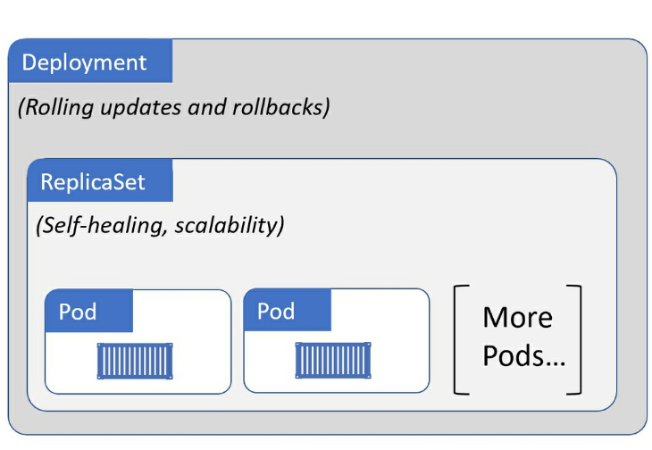

This repository was created for self learning purpose.
- References:
   -  https://www.youtube.com/watch?v=1xo-0gCVhTU&list=PLCOzDPP_yQKiVcDr2ywEsfki6ZPKXpeoC&index=5&ab_channel=JamesQuigley
   - https://www.youtube.com/watch?v=d6WC5n9G_sM&ab_channel=freeCodeCamp.org
   - https://www.youtube.com/watch?v=y_vy9NVeCzo&ab_channel=CloudWithRaj

## #  Kubernetes

### What is it?
 - It is an open source system for automating deployment, scaling, and management of containerized applications.

### Runing local
 - Install kubectl
 - Install minikube

### Kubernetes Vocab
 - Node: It is an instance of a computer, running kubernetes
    - Kubelet
    - Communicates with master
    - Runs pods
 - Pod
    - Runs 1+ containers
    - Exists on a node
    - Each pod gets its own IP address (public or private)
    - Ephemeral — new IP address upon re-creation of pod
 - Services
    - Handles requests: Either coming from inside the cluster (one node to another), or from outside.
    - Usually a load balancer
    - With Service, if the pod dies, its IP address will not change upon re-creation
      - Types: ClusterIP, LoadBalancer, NodePort.
- Deployment
    - Defines desired state
    - Used to define blueprint for pods
    - In practice, we deal with deployments and not pods themselves
    - Deployments usually have replicas such that when any component of the application dies, there is always a backup
- Ingress
    - With Services, we may now have a web application exposed on a certain port, say 8080 on an IP address, say 10.104.35. In practice, it is impractical to access a public-facing application on http://10.104.35:8080.
    - We would thus need an entrypoint with a proper domain name (e.g., https://my-domain-name.com, which then forwards the request to the Service (e.g., http://10.104.35:8080)
    - In essence, Ingress exposes HTTP and HTTPs routes from outside the cluster to services within the cluster [1].

- For running locally, we need to install kubectl and minikube
`Minikube:  creates a VM on your local machine and deploys a simple cluster containing only one node.`

`kubectl: interacts with both the node AND the container, it is like the command line to interact with the cluster.`

## Architecture explanation

## Deployment file explanation

